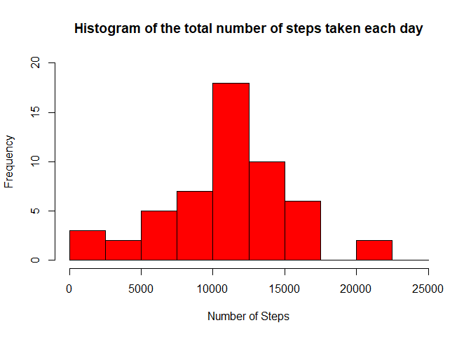
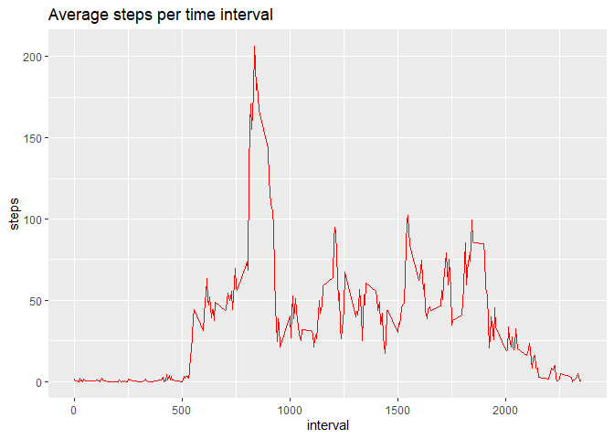
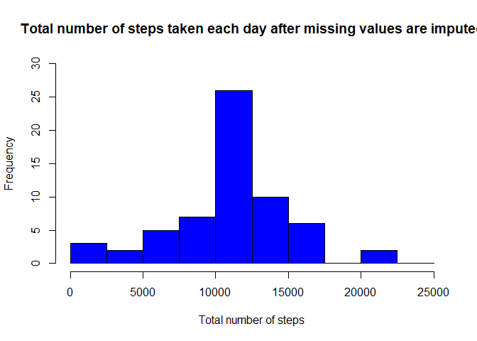

## Loading and preprocessing the data

```r
setwd("C:/Users/Chashika/Desktop/coursera/R/Reproducible Research/RepData_PeerAssessment1")
activity <- read.csv("activity.csv", stringsAsFactors = FALSE)

#Converting the "date" to a Data class and "interval" variable to a factor:
activity$date <- as.Date(activity$date, "%Y-%m-%d")
str(activity)
```

```
## 'data.frame':	17568 obs. of  3 variables:
##  $ steps   : int  NA NA NA NA NA NA NA NA NA NA ...
##  $ date    : Date, format: "2012-10-01" "2012-10-01" ...
##  $ interval: int  0 5 10 15 20 25 30 35 40 45 ...
```

## What is mean total number of steps taken per day?


```r
#Creating a data frame for each day's steps
steps <- aggregate(steps ~ date, data = activity, sum)

#Adding Column names
colnames(steps) <- c("date", "steps")

#Making a histogram of the total number of steps taken each day:
hist(as.numeric(steps$steps), breaks = seq(from=0, to=25000, by=2500), col = "red", ylim = c(0,20), xlab = "Number of Steps", main = "Histogram of the total number of steps taken each day")
```

<!-- -->

```r
#Mean
mean(steps$steps)
```

```
## [1] 10766.19
```

```r
#Median
median(steps$steps)
```

```
## [1] 10765
```

## What is the average daily activity pattern?


```r
#Calculating the average
avg_steps<-aggregate(activity$steps,by=list(activity$interval),FUN=mean,na.rm=TRUE)

colnames(avg_steps)<-c("interval","steps")

library(ggplot2)
```

```
## Warning: package 'ggplot2' was built under R version 3.6.3
```

```r
#Plotting the average daily activity pattern
library(ggplot2)

ggplot(aes(x = interval, y = steps), data = avg_steps) + geom_line(col = "red") + ggtitle("Average steps per time interval")
```

<!-- -->

```r
#Maximum average of five minute interval
avg_steps[avg_steps$steps == max(avg_steps$steps), 1]
```

```
## [1] 835
```
## Imputing missing values


```r
sum(is.na(activity$steps))
```

```
## [1] 2304
```

```r
# Replace NA values with the mean of the steps
activity$steps[is.na(activity$steps)]<-mean(activity$steps,na.rm=TRUE)
```
Here are some rows of new data set


```r
head(activity)
```

```
##     steps       date interval
## 1 37.3826 2012-10-01        0
## 2 37.3826 2012-10-01        5
## 3 37.3826 2012-10-01       10
## 4 37.3826 2012-10-01       15
## 5 37.3826 2012-10-01       20
## 6 37.3826 2012-10-01       25
```
Histogram with replaced NA values


```r
sum_steps <- aggregate(activity$steps, by = list(activity$date), FUN =  sum, na.rm = TRUE)

hist(sum_steps$x, breaks = seq(from = 0, to = 25000, by = 2500), col = "blue", xlab = "Total number of steps", ylim = c(0,30), main = "Total number of steps taken each day after missing values are imputed")
```

<!-- -->

```r
mean(sum_steps$x)
```

```
## [1] 10766.19
```

```r
median(sum_steps$x)
```

```
## [1] 10766.19
```

## Are there differences in activity patterns between weekdays and weekends?


```r
# Convert date into weekdays

activity$days=tolower(weekdays(activity$date))

#Now categorised days into weekend and weekdays

activity$day_type<-ifelse(activity$days=="saturday"|activity$days=="sunday","weekend","weekday")

#Take mean steps taken on weekend or weekday in the intervals

avg_steps<-aggregate(activity$steps,by=list(activity$interval,activity$day_type),FUN=mean,na.rm=TRUE)

colnames(avg_steps)<-c("interval","day_type","steps")

# Create panel plot between average steps and interval seperated by day type

ggplot(aes(x=interval,y=steps),data=avg_steps)+geom_line()+facet_wrap(~avg_steps$day_type)
```

<!-- -->
